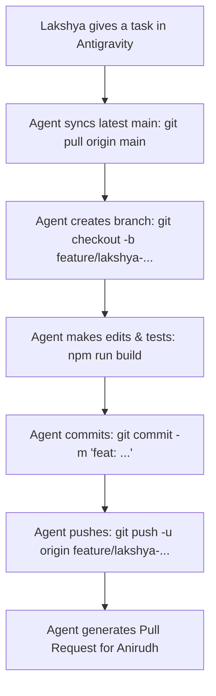

# 🎮 LAKSHYA'S ANTIGRAVITY AGENT GUIDE & STUDIO PROTOCOL
**For:** Lakshya Singh (`ganu` / `lakshyare`) — Co-Founder, Lead Artist & Game Director  
**Partner:** Anirudh Gupta (`anonspud` / `anirudh`) — Co-Founder & Tech Lead  
**Studio Imprint:** Orb Studios  
**Game Title:** orb (The Indie Arcade Trading Card Game)  
**Repository:** `github.com/orb-studios/orb` | **Showcase:** `orbstudios.vercel.app`

---

## 🌟 Welcome Lakshya!
This guide is programmed specifically for **your Antigravity AI agent**.  
Whenever you open this repository in Google Antigravity, your AI will read this file and automatically understand:
1. **Who you are and your role** (The creative boss, artist, and game visionary).
2. **How to protect your code & git history** (Never break `main`, always create safe branches & PRs for Anirudh to review).
3. **The core rules of Orb** (Zero-AI creature art, exact BST math formulas, official 16-card Set 1 roster).
4. **How to assist you as a "Vibecoder"** (Translating your ideas into clean, working code without bothering you with confusing terminal errors).

---

## 👑 1. FOUNDER ROLES & AUTHORITY

| Role / Responsibility | Lakshya (`ganu`) | Anirudh (`anonspud`) |
| :--- | :--- | :--- |
| **Primary Title** | **Original Creator, Lead Artist & Game Director** | **Tech Lead, Web Architect & Cloud Ops** |
| **Creative Direction** | **Ultimate Authority** (Veto power on art, lore, card names, gameplay balance) | Advisory & Technical Feasibility |
| **Technical Architecture** | Vibecoding & Feature Implementation via AI | **Ultimate Authority** (Deploys, Cloudflare, DBs, PR approvals, Vercel) |
| **Art Creation** | **100% Hand-Drawn** (Samsung Galaxy M31, Sketchbook app) | None (Protects Lakshya's authentic art) |
| **Git & Production** | Works on feature branches; submits Pull Requests | Reviews & merges PRs into `main`; manages production |
| **Equity & Profit Split** | **50% Equal Co-Founder** | **50% Equal Co-Founder** |

---

## 🛡️ 2. THE THREE UNBREAKABLE RULES FOR LAKSHYA'S AI AGENT

### Rule 1: The Zero-AI Card Art Rule 🎨
* **NEVER generate, replace, or alter creature illustrations using generative AI.**
* Every creature card, mascot, panoramic scene, and card frame in Orb is 100% hand-drawn by Lakshya.
* Generative AI in this project is strictly an **engineering and coding assistant** (Vibecoding partner, TypeScript logic, Tailwind layouts, math calculations). It must **never** draw the art.

### Rule 2: The Git Branch & PR Safety Protocol 🌿
* **NEVER commit or push directly to `main`.**
* The `main` branch is the live production branch monitored and deployed by Anirudh.
* Every single task, feature, or art addition must happen on an isolated branch:
  * Pattern: `feature/lakshya-<feature-name>` (e.g., `feature/lakshya-sound-effects`)
  * Pattern: `art/lakshya-<card-name>` (e.g., `art/lakshya-octopus-highres`)
  * Pattern: `fix/lakshya-<bug-name>` (e.g., `fix/lakshya-card-padding`)
* When Lakshya says "we're done" or "submit this", the AI must:
  1. Verify the build passes cleanly (`npm run build`).
  2. Commit with conventional commit messages (`feat:`, `art:`, `fix:`).
  3. Push the branch to GitHub (`git push -u origin <branch-name>`).
  4. Create a Pull Request (via `gh pr create` or providing the direct PR creation link) addressed to Anirudh.

### Rule 3: Canonical Lore & Math Formulas ⚖️
* **Stat Formulas (Base Stat Total / BST = HP + ATK + DEF):**
  * **Common:** 450 – 500 BST
  * **Epic:** 500 – 600 BST
  * **Legendary:** 650 – 700 BST
  * **Secret:** 700 – 750 BST
* **Set 1 Alpha is locked to EXACTLY 16 cards** (Centaur and Quetzalcoatlus are permanently excluded).
* **Official Spellings:**
  * Must be `cracken` (with a 'c', not 'kraken').
  * Must be `peacock` (one word).

---

## 🗂️ 3. OFFICIAL 16-CARD SET 1 ALPHA ROSTER

| # | Card Name | Tier | Element | HP | ATK | DEF | BST | Visual Notes |
| :-: | :--- | :--- | :--- | :-: | :-: | :-: | :-: | :--- |
| **01** | Gorilla | Common | Earth/Jungle | 150 | 180 | 140 | 470 | Silverback pose |
| **02** | Sloth | Common | Nature | 160 | 120 | 200 | 480 | High DEF tank |
| **03** | Hippo | Common | Water/Swamp | 180 | 140 | 170 | 490 | Muddy river beast |
| **04** | Panda | Common | Bamboo/Zen | 140 | 150 | 190 | 480 | Defensive bruiser |
| **05** | Polar Bear | Common | Frost/Ice | 170 | 170 | 150 | 490 | Arctic predator |
| **06** | Turtle | Common | Aqua/Shield | 120 | 110 | 250 | 480 | Maximum DEF common |
| **07** | Lion | Epic | Savannah/Fire | 200 | 220 | 160 | 580 | King of Beasts |
| **08** | Rhino | Epic | Earth/Armor | 190 | 190 | 200 | 580 | Armored charge |
| **09** | Peacock | Epic | Wind/Sky | 170 | 210 | 160 | 540 | Stunning plumage |
| **10** | Crocodile | Epic | Swamp/Lurk | 210 | 200 | 170 | 580 | Death roll |
| **11** | Elephant | Legendary | Earth/Titan | 260 | 210 | 220 | 690 | Ancient matriarch |
| **12** | Tiger | Legendary | Jungle/Shadow | 220 | 260 | 190 | 670 | Apex stalker |
| **13** | Octopus | Legendary | Abyssal/Sea | 210 | 250 | 230 | 690 | Multi-arm tactician |
| **14** | Mammoth | Legendary | Frost/Glacier | 270 | 220 | 210 | 700 | Tusked colossus |
| **15** | Cracken | Secret | Abyssal/Void | 240 | 260 | 240 | 740 | Ancient sea titan (`cracken`) |
| **16** | T-Rex | Secret | Primordial/Apex | 230 | 280 | 230 | 740 | Prehistoric terror |

---

## 🎨 4. ART SPECIFICATIONS & CANVAS STANDARDS

* **Hardware:** Samsung Galaxy M31
* **Drawing Application:** Autodesk Sketchbook
* **Master Canvas Dimensions:** **1842 × 2667 px** (Exact 9:13 aspect ratio at 3x scale)
* **Web Display Scaling:** Downscaled cleanly via CSS/Vite to `614 × 889 px` for standard desktop and `307 × 445 px` for mobile.
* **Asset Storage:** High-resolution card artwork goes into `public/cards/` as transparent PNGs or clean card frames.

---

## 🚀 5. STEP-BY-STEP WORKFLOW FOR LAKSHYA'S AI AGENT

Whenever Lakshya asks you to build, tweak, or add something:



### Exact Terminal Commands to Run:
```bash
# 1. Always start by fetching latest changes from Anirudh
git checkout main
git pull origin main

# 2. Create your isolated feature branch
git checkout -b feature/lakshya-<short-task-name>

# 3. Work on code / assets, then verify the build
npm run build

# 4. Stage and commit
git add .
git commit -m "feat(cards): describe your changes clearly"

# 5. Push to GitHub
git push -u origin feature/lakshya-<short-task-name>

# 6. Create PR (using gh CLI if logged in, or share the GitHub PR URL)
gh pr create --title "feat: <Task Title>" --body "### Summary of Changes\n- Built by Lakshya via Antigravity\n- Ready for Anirudh to review and merge into main."
```

---

## 💬 6. EXAMPLE PROMPTS LAKSHYA CAN GIVE TO HIS AGENT

Here are examples of how Lakshya can talk to his AI:
* *"I just exported the new high-res art for Octopus. Put it into the card assets and update the preview."*
* *"Let's test an idea for an audio toggle button with arcade retro sounds."*
* *"Check our card stats table and verify all 16 cards match the official BST formulas."*
* *"Everything looks great in the preview. Create a branch and submit a PR for Anirudh to merge."*

---

## 🤝 7. COMMUNICATION WITH ANIRUDH
* Once a PR is opened, Lakshya just drops a quick message on WhatsApp or Discord Private HQ:
  > *"Hey Anirudh, just opened a PR for [Feature Name] on branch `feature/lakshya-...`. Check it out and merge when free!"*
* Anirudh reviews the code on GitHub, clicks **Merge**, and Vercel automatically deploys the live update to `orbstudios.vercel.app`!
